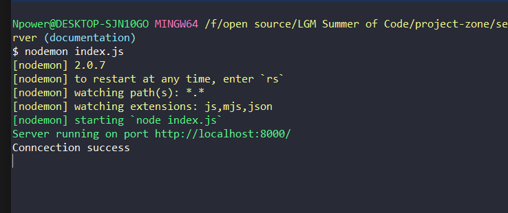
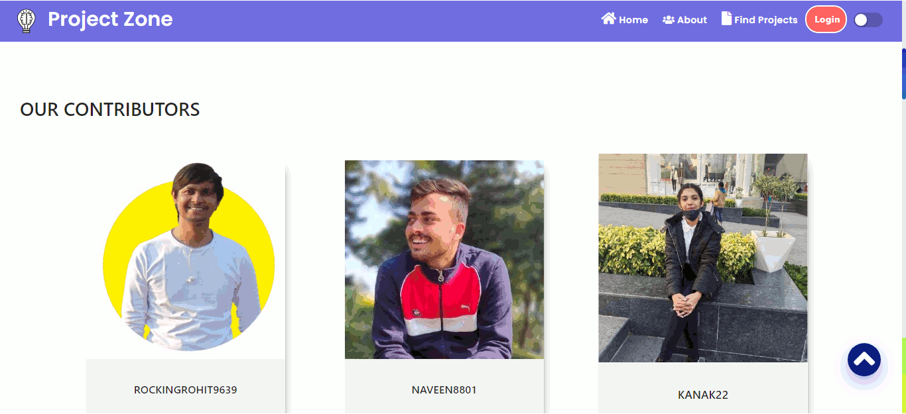

<center> <h1> Project Zone 🚀 </h1> </center>
 
<div align="center">
 


<a href="https://github.com/rockingrohit9639/project-zone"></a>
<a href="https://github.com/rockingrohit9639/project-zone"></a>
<a href="https://github.com/rockingrohit9639/project-zone"></a>
<a href="https://github.com/rockingrohit9639/project-zone/blob/main/LICENSE"></a>
<a href="https://letsgrowmore.slack.com/archives/C024CFH4ATW"></a>

<a href="https://github.com/rockingrohit9639/project-zone/watchers"></a>
<a href="https://github.com/rockingrohit9639/project-zone/graphs/contributors"></a>
<a href="https://github.com/rockingrohit9639/project-zone/stargazers"></a>
<a href="https://github.com/rockingrohit9639/project-zone/network/members"></a>
<a href="https://github.com/rockingrohit9639/project-zone/issues"></a>
<a href="https://github.com/rockingrohit9639/project-zone/issues?q=is%3Aissue+is%3Aclosed"></a>
<a href="https://github.com/rockingrohit9639/project-zone/pulls"></a>
<a href="https://github.com/rockingrohit9639/project-zone/pulls?q=is%3Apr+is%3Aclosed"></a>

</div>

#### Project Zone suggest users the projects they can create based on their skills


# Problem 😧

When we participate in any hackathon, we always face an issue i.e what project should you create you always seek for some inspiration for projects. Or, when we learn a new tech skill like react, angular, node or anything, then we always go to google or youtube to find some project ideas.

> #### So if you face the same problem we are here to help you! 🤩

# Solution 😃

Project Zone suggests a user about the projects they can create based on their skills. Project Zone has a collection of wide variety of projects for many different skill-sets. You can also add some projects of your choice on Project Zone.
Project Zone has the categories of projects from beginner level to advanced level.

<hr>

# Features

- Login/Signup
- Email Verification
- Find best projects
- Find projects based on your skills
- Filter projects as beginner, intermediate or advanced level
- Get an auto recommended project
- A logged-in user can add his/her project, with a GitHub link too
- Build your profile. Edit it as well
- Get projectones on adding projects or making an enchantment on other projects
- Earn badges
- If you find any bug or you have a suggestion then fill out the form and contact us.

## Frameworks & Tools 🧰

- React
- NodeJs
- ExpressJs
- MongoDB

# Setting up the project for running at localhost 💻

### 🚩 Forking repository :

- Firstly you have to make your own copy of the project. For that, You have to fork the repository. You can find the fork button on the top-right side of the browser window. (Refer to the image below )
- Kindly wait till it gets forked.
- After that copy will look like <your-user-name>/project-zone forked from rockingrohit/project-zone
  

### 🚩 Clone repository :

- Now you have your own copy of the project. Here you have to start your work.
- Go to the desired location on your computer where you want to set up the project.
- Right-click there and click on git bash. A terminal window will pop up.
- Type the command git clone <your-fork-url>.git and hit enter.
- Wait for few seconds till the project gets copied.


## Follow the Contribution Guidelines

Following are the steps to guide you:

- Step 1: Fork <a href="https://github.com/rockingrohit9639/project-zone" target="_blank">this</a> repository.


Then go to your Git terminal and clone it on your machine.
<br>
<br>

<br>

- Step 2: Add a upstream link to main branch in your cloned repo
  ```
  git remote add upstream https://github.com/rockingrohit9639/project-zone.git
  ```
- Step 3: Keep your cloned repo upto date by pulling from upstream (this will also avoid any merge conflicts while committing new changes)
  ```
  git pull upstream main
  ```
- Step 4: Create your feature branch (This is a necessary step, so don't skip it)
  ```
  git checkout -b <feature-name>
  ```
- Step 5: Track your changes:heavy_check_mark: .
  ```
  git add .
  ```
- Step 5: Check for your changes.
  ```
  git status
  ```
- Step 7: Commit all the changes (Write commit message as "Small Message")
  ```
  git commit -m "Write a meaningfull but small commit message"
  ```
- Step 8: Push the changes for review
  ```
  git push origin <branch-name>
  ```
- Step 9: Create a PR on Github. (Don't just hit the create a pull request button, you must write a PR message to clarify why and what are you contributing)

### 🚩 Setting up the environment

#### Client-Side

- To setup the environment in your system run the following commands
  ```
  cd project-zone
  npm install
  ```
- After installing all the server dependencies run the server using the following command

  ```
  npm start
  ```

#### Server

- To setup server in your system run the following commands
  ```
  cd project-zone
  cd server
  npm install
  ```
- After installing all the dependencies go through the following commands to make a directory named config inside server directory & add a fille config.env in config directory.
  ```
  mkdir config
  cd config
  touch config.env
  ```
- Edit config.env as follow :-
  ```
  PORT=8000
  MONGO_URI=<YOUR-MONGO-URI>
  ACCESS_TOKEN_SECRET=<YOUR-ACCESS-TOKEN-SECRET>
  ACCESS_TOKEN_SECRET_FOREGTPASS=<YOUR-ACCESS-TOKEN-SECRET-FORGETPASS>
  ACCESS_TOKEN_VERIFY_EMAIL=<YOUR_ACCESS_TOKEN_SECRET_VERIFYEMAIL>
  SENDGRID_API_KEY=<YOUR-SENDGRID-API-KEY>
  SENDGRID_VERIFIED_MAIL=<YOUR-SENDGRID-VERIFIED-MAIL>
  ```
- After following all above steps, run the following command to start server
  ```
  cd ../
  nodemon index.js
  ```
- Expected Output in terminal

<p align="center">
&ensp;&ensp;&ensp;
</p>

# Preview 👀

<p align="center">
  &ensp;&ensp;&ensp;
</p>

## 📌 Opensource Programs

### This project is a part of following Open Source Program

<br>

<table style="width:80%;background-color:white;border-radius:30px;">
    <tr>
  <td>
<center>
  <a href="https://letsgrowmore.in/soc/"></img></a>
  </center>
  </td>
  </tr>
</table>

# Our Contributors 🎇

### Credits goes to these people:

<table>
<tr>
<td>
<a href="https://github.com/rockingrohit9639/project-zone/graphs/contributors">

</a>
</td>
</tr>
</table>

## Code of Conduct

<p align="center">
<a href="https://github.com/rockingrohit9639/project-zone/blob/main/CODE_OF_CONDUCT.md">
</p>
<h5 align="center"><b>Click to read</b></a>

## License

<p align="center">
<a href="https://github.com/rockingrohit9639/project-zone/blob/main/LICENSE">
</p>
<h5 align="center"><b>MIT License</b></a>
