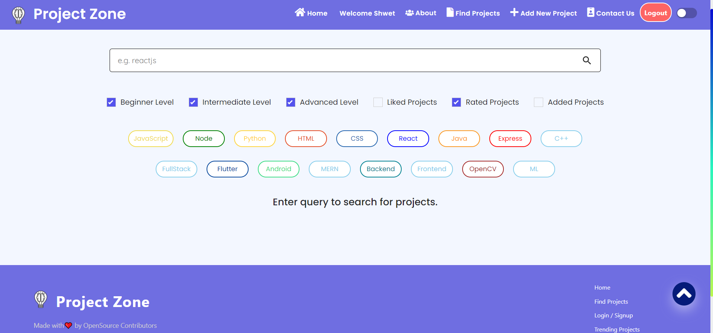

<center> <h1> Project Zone 🚀 </h1> </center>
<div align="center">

[](https://github.com/rockingrohit9639/project-zone)
[](https://github.com/rockingrohit9639/project-zone)

[](https://github.com/rockingrohit9639/project-zone)

[](https://letsgrowmore.slack.com/archives/C024CFH4ATW)

</div>

 #### Project Zone suggest users the projects they can create based on their skills.
 


# Problem 😧
When we participate in Hackathons, We always face one issue that is an ideas for project or inspiration. When we learn a new skill we face problems in implementing it in a project. 

 >  #### So if you face the same problem we are here to help you! 🤩

 # Solution 😃

Project-Zone web-app suggests the user about the projects they can create based on their skills. Like if we learn some new tech, We always search for beginner level projects in node, intermediate level projects in ReactJs, and so on. For this, We have to explore a lot on Google and YouTube to get the projects. So, if we have all these projects in one place it will be very much easier for a beginner to find project ideas!
We have the categories from beginner to startup level project ideas and we also have an option to add new projects.
Our app is in its initial stage, We will improve it a lot. 🔥
<hr>

## Frameworks & Tools 🧰
- React
- Elasticsearch 
- Magic Lab
- Material UI

# Setting up the project for running at localhost 💻

### 🚩 Forking repository :
- Firstly you have to make your own copy of the project. For that, You have to fork the repository. You can find the fork button on the top-right side of the browser window. (Refer to the image below )
- Kindly wait till it gets forked.
- After that copy will look like <your-user-name>/project-zone forked from rockingrohit/project-zone
 
### 🚩 Clone repository :
- Now you have your own copy of the project. Here you have to start your work.
- Go to the desired location on your computer where you want to set up the project.
- Right-click there and click on git bash. A terminal window will pop up.
- Type the command git clone <your-fork-url>.git and hit enter.
- Wait for few seconds till the project gets copied.
 

## Follow the Contribution Guidelines

Following are the steps to guide you:

* Step 1: Fork the repo and Go to your Git terminal and  clone it on your machine.
* Step 2: Add a upstream link to main branch in your cloned repo
    ```
    git remote add upstream https://github.com/rockingrohit9639/project-zone.git
    ```
* Step 3: Keep your cloned repo upto date by pulling from upstream (this will also avoid any merge conflicts while committing new changes)
    ```
    git pull upstream main
    ```
* Step 4: Create your feature branch (This is a necessary step, so don't skip it)
    ```
    git checkout -b <feature-name>
    ```
* Step 5: Track your changes:heavy_check_mark: .
    ```
    git add .
    ```
* Step 5: Check for your changes.
    ```
    git status
    ```
* Step 7: Commit all the changes (Write commit message as "Small Message")
    ```
    git commit -m "Write a meaningfull but small commit message"
    ```
* Step 8: Push the changes for review
    ```
    git push origin <branch-name>
    ```
* Step 9: Create a PR on Github. (Don't just hit the create a pull request button, you must write a PR message to clarify why and what are you contributing)


### 🚩 Setting up the environment
- To setup the environment in your system run the following commands
```
cd project-zone
npm install
```

- After installing all the server dependencies run the server using the following command

```
npm start
```


# Preview 👀

<p>
 &ensp;&ensp;&ensp;
  &ensp;&ensp;&ensp;

</p>

## 📌 Opensource Programs

### This project is a part of following Open Source Program
<br>

<table style="width:80%;background-color:white;border-radius:30px;">
    <tr>
  <td>
<center>
  <a href="https://letsgrowmore.in/soc/"></img></a>
  </center>
  </td>
  </tr>
</table>

### Levels & Points

<table>
  <tr>
    <th>Level</th>
    <th>Points</th> 
  </tr>
  <tr>
    <td>Level 0</td>
    <td>5</td>
  </tr>
  <tr>
    <td>Level 1</td>
    <td>10</td>
  </tr>
  <tr>
    <td>Level 2</td>
    <td>15</td>
  </tr>
  <tr>
    <td>Level 3</td>
    <td>30</td>
  </tr>
  <tr>
    <td>Level 4</td>
    <td>45</td>
  </tr>
</table>

# Our Contributors 🎇
### Credits goes to these people:

<table>
<tr>
<td>
<a href="https://github.com/rockingrohit9639/project-zone/graphs/contributors">

</a>
</td>
</tr>
</table>


## Code of Conduct
<p align="center">
<a href="https://github.com/rockingrohit9639/project-zone/blob/main/CODE_OF_CONDUCT.md">
</p>
<h5 align="center"><b>Click to read</b></a>  

## License 
<p align="center">
<a href="https://github.com/rockingrohit9639/project-zone/blob/main/LICENSE">
</p>
<h5 align="center"><b>MIT License</b></a> 